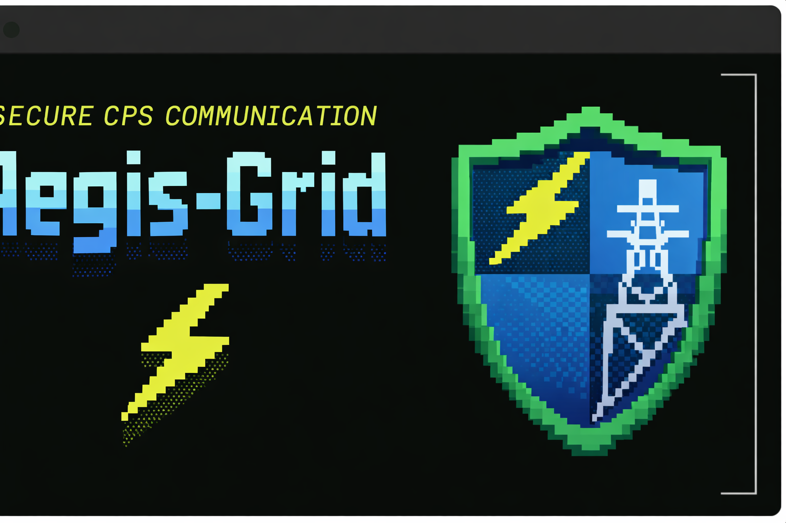

Aegis-Grid
==========

Aegis-Grid is a research framework for studying adaptive, agent-based
security mechanisms in cyber-physical power systems.

The framework focuses on fail-secure communication, where messages are
either delivered correctly within defined constraints or intentionally
invalidated. The emphasis is on robustness under packet loss, delay,
and active interference.

This repository is intended for research inspection, model comparison,
and methodological study.

--------------------------------------------------

Versioned Research Structure

Each version in this repository represents a distinct modeling scope
and threat surface. Versions are not incremental releases but separate
research stages.

v1  Baseline fail-secure communication and fragmentation semantics  
v2  Adaptive thresholding and sustained attack pressure modeling  
v3  Agent-based autonomous security control  
v3.3 Extended cyber-physical timing evaluation  
v4  Grid-aware security constraints and safety coupling  
v5  Conceptual post-cryptographic and quantum-adversarial model  

Each version contains its own documentation and is independently
inspectable.

--------------------------------------------------

Model-Level Comparison

A qualitative comparison across all versions is provided in:

docs/MODEL_COMPARISON.md

This comparison:
- uses no plots
- introduces no new data
- makes no performance claims
- compares assumptions, scope, and threat models only

--------------------------------------------------

Reproducibility and Auditability

All figures and results in this repository are generated directly from
analytical expressions or raw simulation outputs.

No data points are removed.  
No smoothing or curve fitting is applied.  
Parameters are stated explicitly in scripts or documentation.  
All generation code is included in the repository.

Relevant files include:

docs/FIGURE_PROVENANCE.md  
audit_version_completeness.sh  

--------------------------------------------------

Scope Disclaimer

Aegis-Grid is a research framework and not a production security system.
Some core logic is abstracted. Results are provided for inspection,
reproducibility, and academic discussion only.

